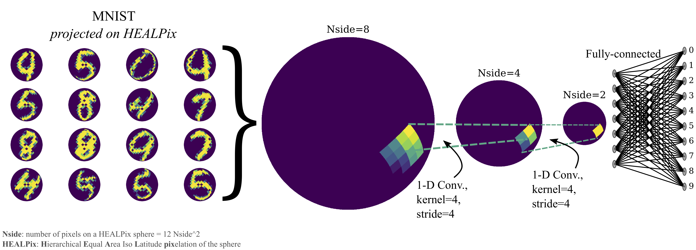
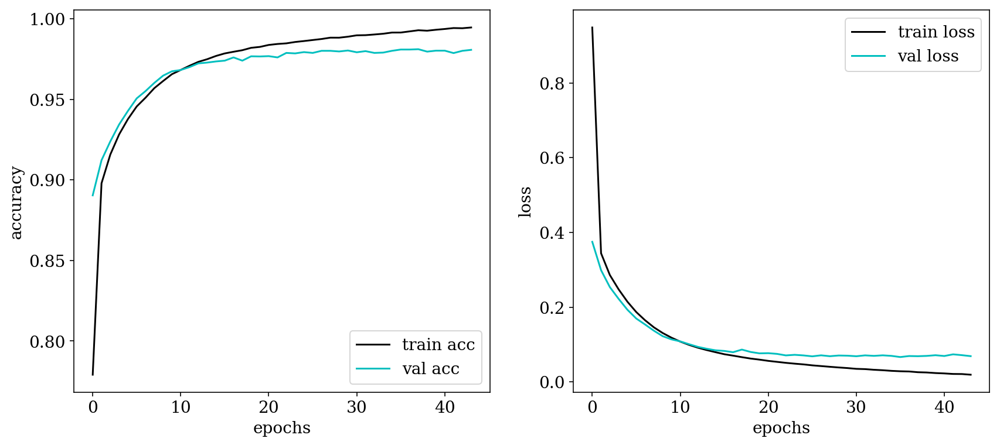
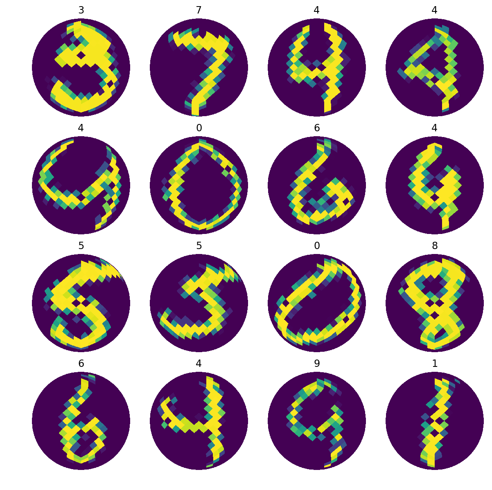

# Conv1D-HEALPix
An experimental implement of Conv-1D on HEALPix array. This idea popped up while I was researching in cosmology using HEALPix. Guess it could be a toy model for some astronomers love to play with HEALPix.

# Warning
This repository served as a PyTorch and a Keras version of HEALPix CNN. We should keep in mind that this implementation of CNN on spheres is relatively naive, and there are some other sophisticated models in the field of geometric deep learning. However, what I would like to show is a quick and dirty way to allow astronomers to try CNN on spheres with their own hands and laptops. The other point is that the hierarchical pixelization scheme might be helpful for future CNN on spheres. HEALPix by its nature is not fully hierarchically arranged because of the 12 base pixels.

# HEALPix + Conv1D = convolution on Healpix spheres

HEALPix is a data structure for spherical images which frequently used in astronomy. The hierarchical pixelization characteristics of HEALPix allowed us to build CNN layers between different $Nside$s of full-sky images. 

For further information about HEALPix, please find [here](http://healpix.sourceforge.net/) and official paper [K.M. Górski et al., 2005, ApJ, 622, p759](http://adsabs.harvard.edu/cgi-bin/nph-bib_query?bibcode=2005ApJ...622..759G&db_key=AST&high=41069202cf02947).
    
We built a simple two layers of 1-D CNN with a layer of a fully-connected network to classify MNIST hand-written digit images (images with $0\sim9$ digits) on spherical images. The MNIST dataset was projected onto HEALPix with $Nside$ equal to 8, and we set each layer of CNN to downgrade a level of hierarchical pixelization. The validation accuracy approached 97.5% within 100 epochs.




# (Ongoing) DCGAN + HEALPix + Conv1D = image generation on spheres
We also tried to apply a similar structure of Conv-1D + HEALPix on DCGAN, but the results were awkward. We projected the MNIST onto HEALPix grid with $Nside=16$. The discriminator was designed similarly as MNIST classification task but using three CNN layers, and the generator was built from four deconvolution layers with the first layer broadcasting the input latent space noise to 12 base pixels in HEALPix. 
    
The generated spherical MNIST digits were not realistic comparing to the counterparts from the ordinary rectangle images. One of the obvious barriers is that the 12 base pixels are not hierarchically distributed as the rest children pixels. The other reason might due to the inability to move filter pixel by pixel, which forced the downgrade happened in each HEALPix CNN layer. 

# Requirements
- `numpy`, `healpy`, `matplotlib`
- PyTorch version: 
    - `torch`
    - `torchvision`
- Keras version:
    - `keras`
    - `tensorflow`

# Using the scipt
We only have a `.py` written in PyTorch. The way to execute it is to run the following command in your terminal:
```bash
python MNIST-HEALPix-Conv1D.py --use_gpu=False --epochs=100 --batch_size=32 
```